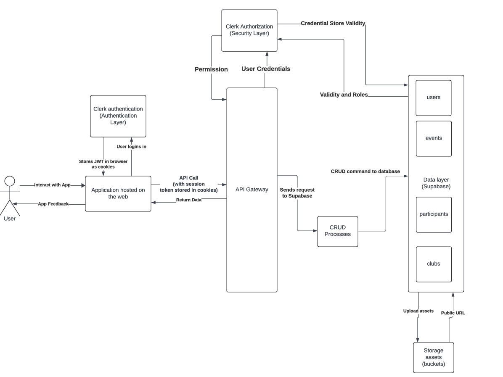

# ClubHub
**Live Deployment:** [ClubHub on Vercel](https://club-aza5rwh1k-projlabs-projects.vercel.app)

## 1. Project Overview
**Team UniUnity:** (5 Developers)

**The Problem:** Students often share a poor experience with school club navigation due to a lack of organization, outdated design, poor accessibility, and a lack of integration across different platforms. 

**The Solution:** ClubHub is a modern, accessible club and event management platform designed to replace bare-bone websites and physical boards. By providing uncluttered text with clear visuals, it streamlines the club discovery process for new students and offers dedicated tools to help club owners manage their communities effectively.

### Team & Individual Contributions
This was a team project built by five developers. My contributions included:

- **UI:** Dedicated Club Page (read-only view)
- **UI:** Dedicated Club Page (edit view)
- **UI:** Event list within a club
- **Backend:** GET Events
- **Backend:** GET Current Club’s Campus
- **Backend:** PATCH Campus (update club-campus information)

## 2. Technology Stack
*   **Frontend / Framework:** Next.js
*   **Backend / Database:** Supabase
*   **Authentication:** Clerk
*   **Deployment:** Vercel
*   **Security & Testing:** GitGuardian, Postman

## 3. System Architecture & Performance
We designed a scalable, secure, and highly responsive architecture to handle user data and authentication:

**

*   **API Gateway & Security Layer:** Integrated **Clerk** for robust authentication. User logins generate secure **JWT (JSON Web Tokens)** stored in the browser as cookies to manage session validity and permissions across the app.
*   **Data & Storage Layer:** Utilized **Supabase** for handling rigorous **CRUD processes** (Create, Read, Update, Delete) and managing storage assets (e.g., event/club banners). 
*   **Responsiveness & Optimization:** Implemented **Client-Side Rendering (CSR) and caching** with Next.js for fast initial page loads. We also utilized Supabase's indexing and optimized data fetching strategies based strictly on page requirements to reduce database bloat.

## 4. Key Features & Product Management
We adopted a User-Centered Design (UCD) approach, creating personas (e.g., New Students, Club Managers, School Admins) and prioritizing features based on User Value and Technical Complexity:

*   **User Engagement & Personalization:** Students can "subscribe" to their favorite clubs and "save" events. These selections are organized into a personalized dashboard (displaying 'Saved Events' and 'Your Clubs'), allowing users to easily track their activities. 
*   **Role-Based Access Control:** The platform features distinct user roles. A key highlight is the dedicated "Club Request Approval" dashboard, where school administrators can efficiently review, approve, or reject new club registrations.
*   **Advanced Event Management:** Features include adding/updating event details, detailed event locations, and a **capacity/RSVP system** (e.g., displaying "5 spots left" and handling requests to join) to prevent overcrowding.
*   **Club Discovery:** Students can utilize robust filters to discover clubs perfectly matching their interests.

## 5. Agile Workflow & CI/CD Pipeline
*   **Sprint Planning:** We rigorously categorized features into High, Medium, and Low priorities to establish a clear Minimum Viable Product (MVP).
*   **CI/CD Pipeline:** We established a strict deployment pipeline: `Local Feature Branch -> Remote Branch (origin/feat) -> Preview Environment -> Main / Production`.
*   **Automated Previews:** Every Pull Request automatically generated a Preview build via Vercel before being safely merged into the main production branch.

## 6. Challenges & Lessons Learned
*   **Technical Challenges:** During development and deployment, we actively navigated and resolved configuration issues related to **Vercel** hosting and diligently handled security vulnerabilities identified by **GitGuardian**.
*   **Agile Lessons:** Aside from overcoming team scheduling conflicts through efficient meetings, our most valuable lesson was identifying our team's **work velocity per sprint**. Understanding our velocity allowed us to craft subsequent sprints much more accurately and effectively.

---

## 7. Getting Started
To run this project locally, follow these steps:

1. Clone the repository and install packages
```bash
git clone https://github.com/projlabs/club-hub
cd club-hub
npm install
```

2. Set up environment variables
Create a .env.local file in the root directory and add your Clerk and Supabase keys:

**Clerk Settings**
```env
NEXT_PUBLIC_CLERK_PUBLISHABLE_KEY=your_publishable_key
CLERK_SECRET_KEY=your_secret_key
```
**Supabase Settings**
```env
SUPABASE_URL=your_supabase_url
SUPABASE_KEY=your_supabase_key
SUPABASE_SERVICE_ROLE_KEY=your_supabase_service_role_key
```

1. **Install packages**
```bash
npm i
2. Make sure you use the Node version v18.17.0
3. Run the development server
npm run dev
```

---